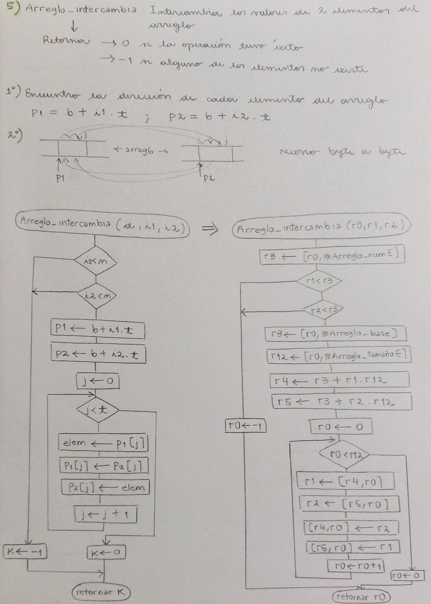

# Memoria técnica - Estructuras de datos en ensamblador de un procesador ARMv7M

Electrónica IV - TP - Estructuras de datos en ensamblador de un procesador ARMv7M

Paula Diaz Romero

## Objetivos

El objetivo de este práctico es resolver problemas de computación usando algoritmos. Los problemas a resolver son:

- Mueve memoria
- Compara regiones de memoria
- Arreglo general descrito por metadatos
- Pila
- Cola

## Análisis del problema y solución

A continuación, se desarrolla cada problema buscando entender qué hace cada función, cómo funciona el programa, su solución mediante diagrama de flujo y posterior implementación de código en ensamblador.

### Referencias

- ARM (2006-2008, 2010, 2014, 2017, 2021). *Armv7-M Architecture Reference Manual*.
